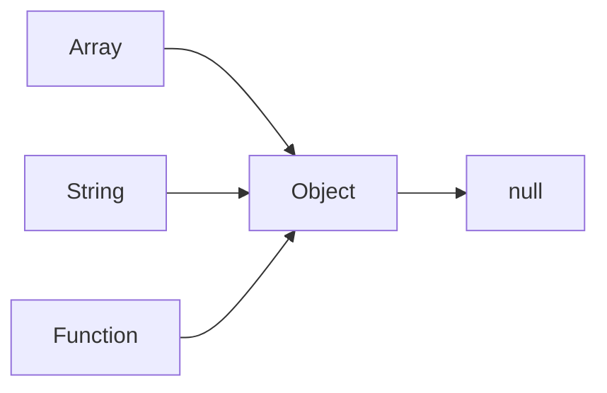

# JAVASCRIPT_ADVANCED_CONCEPT
## JAVASCRIPT_ASYNC_CODE


> setTimeOut function and clear TimeOut function
```HTML
        <button id="stop">STOP</button>
```
```javascript
        let setTimeOutId = setTimeout(()=>{
            console.log("siddharth kumar rai")
        },2000);
        document.getElementById("stop").addEventListener("click",function(){
            clearTimeout(setTimeOutId)
        })
```
> setInterval function and clearInterval function
```HTML
        <button id="start">START</button>
        <button id="stop">STOP</button>
```
```javascript
        let resetInterval;
        const sayName = function(str){
            console.log(str,Date.now())
        }
        document.querySelector("#start").addEventListener("click",(str)=>{
        resetInterval = setInterval(sayName,1000,"hii")
        })
        document.querySelector("#stop").addEventListener("click",function(){
            clearInterval(resetInterval)
        })
```
#### ONCLICKBGCHANGER (refer to BGCOLORCHANGER in root directory)
## api request (XMLHTTP request)
```javascript
        let githubApi = "https://api.github.com/users/siddharthkumarrai"
        // 0	UNSENT	Client has been created. open() not called yet.
        let xhr = new XMLHttpRequest()
        // 1	OPENED	open() has been called.
        xhr.open("GET", githubApi, true)
        console.log("OPENED CALLED", xhr.readyState)
        // 2	HEADERS_RECEIVED	send() has been called, and headers and status are available.
        xhr.send()
        console.log("SEND CALLED", xhr.HEADERS_RECEIVED)
        // 3	LOADING	Downloading; responseText holds partial data.
        xhr.onprogress = () => {
            console.log("LOADING", xhr.readyState)
        }
        // 4	DONE	The operation is complete.
        xhr.onload = ()=>{
            console.log("DONE",xhr.readyState)
        }
        //arrow function ke andar this.responseText nahi use kar sakte response json me parse nahi hota
        xhr.onreadystatechange = ()=>{
            if (xhr.readyState === 4) {
                let res = xhr.response   // string response
                let objdata = JSON.parse(res)
                console.log(typeof objdata)
                console.log(objdata);
                let name = document.querySelector("h1");
                let image = document.querySelector("img");
                name.innerText = objdata.login;
                image.src = objdata.avatar_url  
            }
        }

        // classical function mein this.response likh sate hain
        // xhr.onreadystatechange = function () {
             if(xhr.readyState === 4){
                 let data = this.responseText
                 console.log(data)
             }      
            }
```
## promises
> Method 1
- How to create promise
  ```javascript
  let promiseOne = new Promise(function(resolve,reject){
        //async task
        setTimeout(function(){
            console.log("siddharth kumar rai")
            resolve()
        },1000)
  })
  ```
- How to consume promise
```javscript
    promiseOne.then(function(){
        console.log("promise was consumed")
    })
```
> Method 2
```javscript
    new Promise(function(resolve,reject){
        setTimeout(function(){
            console.log("Db connected 2")
            resolve()
        },1000)
    }).then(function(){
        console.log("promise two consumed")
    })
```
> Method 3
```javascript
    et promiseThree = new Promise(function(resolve,reject){
    setTimeout(function(){
        console.log("new DB CONNECTED 3");
        resolve({username:"siddharth", id: 123})
        
    },1000)
})

promiseThree.then(function(data){
    console.log(data)
})
```
> Method 4
```javascript
    let promiseFour = new Promise(function(resolve,reject){
        setTimeout(function(){
            let error = true
            if(!error){
                console.log("DB connected 4" )
                resolve({languageName: "javaScript", id: "js"})
            }else {
                reject("error 404")
            }
        },1000)
    })

    promiseFour.then(function(data){
        console.log("promise four consumed")
        return data.languageName
    }).then(function(username){
        console.log(username)
    })
    .catch(function(error){
        console.log(error,"something went wrong")
    })
    .finally(function(){
    console.log("if promise was resolved then executed otherwise nor resolved then also executed")
    })
```
> Method 5 ( using async await )
```javascript
let promiseFive = new Promise(function(resolve,reject){
    setTimeout(function(){
        let error = false
        if(!error){
            console.log("DB connected 5")
            resolve({languageName: "python",id:"py"})
        }else{
            reject("error 502")
        }
    },1000)
})

async function consumedPromiseFive(){
    try {
    const response = await promiseFive
    console.log(response)
    } catch (error) {
        console.log(error)
    }
}

consumedPromiseFive()

```
## api data handle (api fetch method)
```javascript
        async function getAllUser(){
            try {
              const response = await fetch("https://jsonplaceholder.typicode.com/users")
              const data = await response.json()

              console.log(data)
            } catch (error) {
                console.log(error)
            }
        }

        getAllUser()

        fetch("https://api.github.com/users/siddharthkumarrai")
        .then(function(data){
            let res = data.json()
            return res
        })
        .then(function(result){
            console.log(result)
        }).catch(function(error){
            console.log(error)
        })

// promise.all
// yes this is also available, kuch reading aap b kro.
```
# Classes and OOP
## javascript and classes
### OOP ( programming paradigm ( code likh ne ka structure kya style producer ) )
> Object
- collection of property and methods e.g toUpperCase
> why we use OOP
- code bada messup ho raha tha (concept of spagti code( code reuse nahi ho pa rha tha ))
> parts of OOP
- Object literall
- OOP keywords
  - Constructor function
  - Prototypes
  - Classes
  - Instances (new, this)
> 4 pillars
- Abstraction ( Details hide karlena e.g fetch )
- Encapsulation ( ek wrapper lagana jo jo aap ko access karne deya jaye wo aap access kar paa rahe hain jo nahi karne de raha access nahi kar pa rahe hain)
- Inheritance
- Polymorphism ( ek hi mthod bhut sare kam kar deta hain )

## OOP
> Object literal ( basic unit )
```javascript
   const user = {
        username: "siddharth",
        loginCount: 7,
        signedIn: true,

        getUserDetails: function(){
                console.log(`Username: ${this.username}`)
                console.log(this)        
        }
   }
   console.log(user.name)
   console.log(user.getUserDetails())
   console.log(this)                // {}
```
## constructor
- constructor function ( new keyword ) (in single instance create multiple object )
```javascript
   const promiseOne = new Promise()
   const date new Date()

   function user( username, loginCount, isLoggedIn ){
        this.username = username;
        this.loginCount = loginCount;
        this.isLoggedIn = isLoggedIn;

        return this
   }

   const userOne = new user("siddharth", 7, true)
   const userTwo = new user("abhishek", 17, false)
   console.log(userOne)
   console.log(userOne.constructor) (refrence hota hain khud ke bare mein)
```
- how new keyword work
  - step 1: new object create
  - step 2: constructor function call hota hain new keyword ke karn ye sare argument ko pack kar ke de deta hain
  - step 3: all argument inject in this keyword
  - step 4: function ke ander mil jate hain
## new keyword 
- default behavior of Javascript is prototypal behavior
- Object

  ```javascript
     function multiplyBy7(num){
          return num*7
     }
  
     multiplyBy7.power = 2

     console.log(multiplyBy7(8))          // 56
     console.log(multiplyBy7.power)       // 2
     console.log(multiplyBy5.prototype)   // {} prototype us method ka this hain

     function user(username, score) {
        this.username = username
        this.score = score
     }

     user.prototype.increment = function(){
                this.score++
     }

     user.prototype.printScore = function(){
                console.log(`the score is ${this.score}`)
     }

     const userOne = new user("sidd",77)
     const userTwo = new user("abhi",90)

/*

Here's what happens behind the scenes when the new keyword is used:

A new object is created: The new keyword initiates the creation of a new JavaScript object.

A prototype is linked: The newly created object gets linked to the prototype property of the constructor function. This means that it has access to properties and methods defined on the constructor's prototype.

The constructor is called: The constructor function is called with the specified arguments and this is bound to the newly created object. If no explicit return value is specified from the constructor, JavaScript assumes this, the newly created object, to be the intended return value.

The new object is returned: After the constructor function has been called, if it doesn't return a non-primitive value (object, array, function, etc.), the newly created object is returned.

*/
```
## Prototypes
```javascript
// let myName = "sidd     "
// let mychannel = "fanstatic4     "

// console.log(myName.trueLength);


let myHeros = ["thor", "spiderman"]

let heroPower = {
    thor: "hammer",
    spiderman: "sling",

    getSpiderPower: function(){
        console.log(`Spidy power is ${this.spiderman}`);
    }
}

Object.prototype.sidd = function(){
    console.log(`sidd is present in all objects`);
}

Array.prototype.heysidd = function(){
    console.log(`sidd says hello`);
}

// heroPower.sidd()
// myHeros.sidd()
// myHeros.heysidd()
// heroPower.heysidd()
```

> inheritance
```javascript
const User = {
    name: "sidd",
    email: "sidd@google.com"
}

const Teacher = {
    makeVideo: true
}

const TeachingSupport = {
    isAvailable: false
}

const TASupport = {
    makeAssignment: 'JS assignment',
    fullTime: true,
    __proto__: TeachingSupport
}

Teacher.__proto__ = User
```

> modern syntax
```javascript
Object.setPrototypeOf(TeachingSupport, Teacher)

let anotherUsername = "siddharth     "

String.prototype.trueLength = function(){
    console.log(`${this}`);
    console.log(`True length is: ${this.trim().length}`);
}

anotherUsername.trueLength()
"siddharth".trueLength()
"iceTea".trueLength()
```
## call
```javascript
function SetUsername(username){
    //complex DB calls
    this.username = username
    console.log("called");
}

function createUser(username, email, password){
    SetUsername.call(this, username)
   
    this.email = email
    this.password = password
}

const sidd = new createUser("siddharth", "chai@fb.com", "123")
console.log(sidd);
```
## classes
```javascript
// ES6

class User {
    constructor(username, email, password){
        this.username = username;
        this.email = email;
        this.password = password
    }

    encryptPassword(){
        return `${this.password}abc`
    }
    changeUsername(){
        return `${this.username.toUpperCase()}`
    }

}

const sidd = new User("siddharth", "chai@gmail.com", "123")

console.log(sidd.encryptPassword());
console.log(sidd.changeUsername());

// behind the scene

function User(username, email, password){
    this.username = username;
    this.email = email;
    this.password = password
}

User.prototype.encryptPassword = function(){
    return `${this.password}abc`
}
User.prototype.changeUsername = function(){
    return `${this.username.toUpperCase()}`
}


const sidd = new User("siddharth", "tea@gmail.com", "123")

console.log(sidd.encryptPassword());
console.log(sidd.changeUsername());
```
## inheritance
```javascript
class User {
    constructor(username){
        this.username = username
    }

    logMe(){
        console.log(`USERNAME is ${this.username}`);
    }
}

class Teacher extends User{
    constructor(username, email, password){
        super(username)
        this.email = email
        this.password = password
    }

    addCourse(){
        console.log(`A new course was added by ${this.username}`);
    }
}

const sidd = new Teacher("siddharth", "chai@teacher.com", "123")

chai.logMe()
const abhi = new User("abhishek")

masalaChai.logMe()

console.log(sidd instanceof User);
```
## static property 
```javascript
class User {
    constructor(username){
        this.username = username
    }

    logMe(){
        console.log(`Username: ${this.username}`);
    }

    static createId(){
        return `123`
    }
}

const hitesh = new User("hitesh")
// console.log(hitesh.createId())

class Teacher extends User {
    constructor(username, email){
        super(username)
        this.email = email
    }
}

const iphone = new Teacher("iphone", "i@phone.com")
console.log(iphone.createId());
```
## bind
```html
<body>
    <button>Button Clicked</button>
</body>
<script>
    class React {
        constructor(){
            this.library = "React"
            this.server = "https://localhost:300"

            //requirement
            document
                .querySelector('button')
                .addEventListener('click', this.handleClick.bind(this))

        }
        handleClick(){
            console.log("button clicked");
            console.log(this.server);
        }
    }

    const app = new React()
</script>
```
## ADVANCED OBJECT  getOwnPropertyDescriptor ( object ki kuch property ko change nahi karne dena )
```javascript
const descripter = Object.getOwnPropertyDescriptor(Math, "PI")

console.log(descripter);  // {value: 3.141592653589793, writable: false, enumerable: false, configurable: false }

// console.log(Math.PI);
// Math.PI = 5
// console.log(Math.PI);

const sidd = {
    name: 'siddharth',
    email: "sidd@gmail.com,
    isAvailable: true,

    orderChai: function(){
        console.log("code fat gya");
    }
}

console.log(Object.getOwnPropertyDescriptor(sidd, "name"));

Object.defineProperty(sidd, 'name', {
    //writable: false,
    enumerable: true,
})

console.log(Object.getOwnPropertyDescriptor(sidd, "name"));

for (let [key, value] of Object.entries(sidd)) {
    if (typeof value !== 'function') {
        console.log(`${key} : ${value}`);
    }
}
```
## getter_setter
> getter and setter through class
```javascript
class User {
    constructor(email, password){
        this.email = email;
        this.password = password
    }

    get email(){
        return this._email.toUpperCase()
    }
    set email(value){
        this._email = value
    }

    get password(){
        return `${this._password}sdhkjshskjh`
    }

    set password(value){
        this._password = value
    }
}

const sidd = new User("sidd@777.ai", "abc")
console.log(sidd.email);
```
> getter and setter through function 

```javascript
function User(email, password){
    this._email = email;
    this._password = password

    Object.defineProperty(this, 'email', {
        get: function(){
            return this._email.toUpperCase()
        },
        set: function(value){
            this._email = value
        }
    })
    Object.defineProperty(this, 'password', {
        get: function(){
            return this._password.toUpperCase()
        },
        set: function(value){
            this._password = value
        }
    })

}

const sidd = new User("sidd@gmail.com", "siddharth")

console.log(sidd.email);
```
> getter and setter through object
```javascript
const User = {
    _email: 'sidd@gmail.com',
    _password: "abc",


    get email(){
        return this._email.toUpperCase()
    },

    set email(value){
        this._email = value
    }
}

const sidd = Object.create(User)    // factory function
console.log(sidd.email);
```
## Lexical scoping and Closures
- Lexical scoping ( inner function outer function ke scope ke variable and methods ko access kar sakta hain )
```javascript
    function outer(){
        let username = "hitesh"
        function inner(){
            console.log("inner", username);
        }
        inner()
    }
    outer()
```
- Closures  ( jab hum pura inner function hi return karte hain tab uska pura lexical scope hi return hota hain )
```javascript
    function outer() {
        const name = "Siddharth";
        function inner() {
            console.log(name);
        }
        return inner;
    }

    const myFunc = outer();
    myFunc();
```
> practical implementation of Lexical scoping and Closures
```javascript
```html
<body style="background-color: #313131;">
    <button id="orange">Orange</button>
    <button id="green">Green</button>
</body>
```
```javascript
        // document.getElementById("orange").onclick = function(){
        //     document.body.style.backgroundColor = `orange`
        // }
        // document.getElementById("green").onclick = function(){
        //     document.body.style.backgroundColor = `green`
        // }

        function clickHandler(color){
            // document.body.style.backgroundColor = `${color}`

            return function(){
                document.body.style.backgroundColor = `${color}`
            }
        }

        document.getElementById('orange').onclick = clickHandler("orange")
        document.getElementById('green').onclick = clickHandler("green")
```


   


