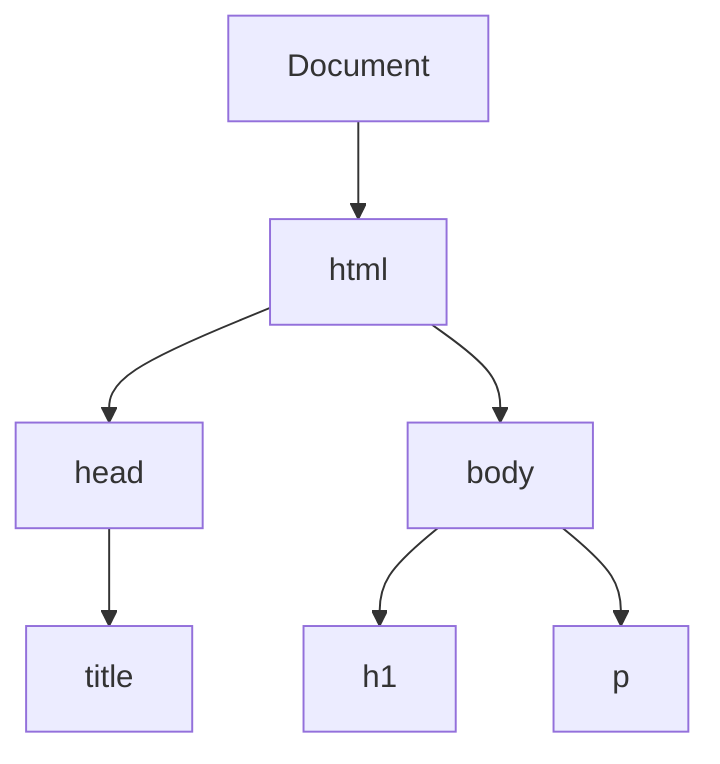
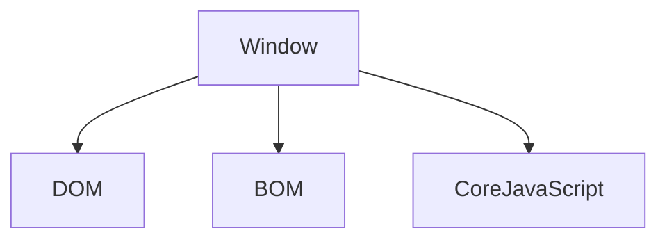

# Js DOM MANIPULATION

**Window Obj ---> global Obj** &nbsp;  &nbsp;    (sab kuch window object ke ander ata hain sab isi ke child hain)

**HTML code ---> convert javascript object  ---> document**

**HTML Tag  ---> Convert token ---> conver node ---> bunch of node is DOM**

## DOM Tree Structure

## DOM Tree Structure

## DOM Tree Structure

graph LR;
    Window --> DOM;
    Window --> BOM;
    Window --> "Core JavaScript";
    
    DOM --> html;
    html --> head;
    html --> body;
    head --> title;
    body --> h1;
    body --> p;

