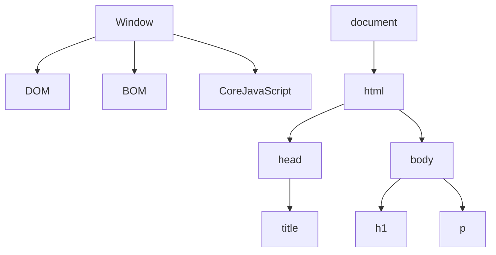

# Js DOM MANIPULATION

**Window Obj ---> global Obj** &nbsp;  &nbsp;    (sab kuch window object ke ander ata hain sab isi ke child hain)

**HTML code ---> convert javascript object  ---> document**

**HTML Tag  ---> Convert token ---> conver node ---> bunch of node is DOM**

## DOM Tree Structure


## DOM MANIPULATION
**Javascript code ke through ---> HTML ko manipulate karna**

```mermaid
graph TD
    A[Root] --> B[Header]
    A --> C[Main]
    A --> D[Footer]
    C --> E[Article]
    C --> F[Sidebar]
    E --> G[Title]
    E --> H[Content]
    F --> I[Links]
    F --> J[Widgets]

    %% Changes
    subgraph Changes
        X[Updated Header] --> Y[New Section]
        Y --> Z[Updated Content]
    end

    %% Highlight changes
    classDef changes fill:#f9f,stroke:#333,stroke-width:2px;
    class X,Y,Z changes;


