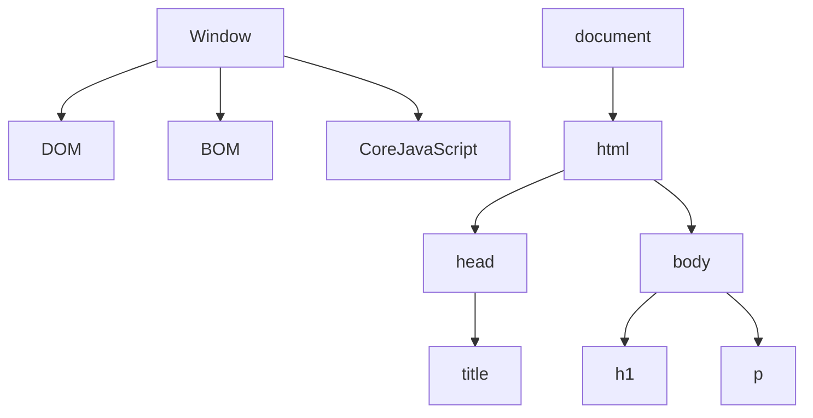
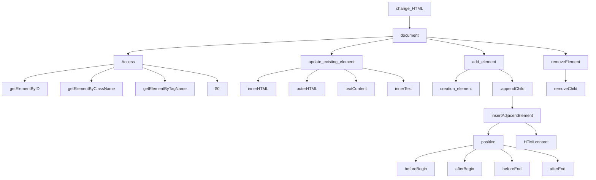

# Js DOM MANIPULATION

**Window Obj ---> global Obj** &nbsp;  &nbsp;    (sab kuch window object ke ander ata hain sab isi ke child hain)

**HTML code ---> convert javascript object  ---> document**

**HTML Tag  ---> Convert token ---> conver node ---> bunch of node is DOM**

## DOM Tree Structure


## DOM MANIPULATION
**Javascript code ke through ---> HTML ko manipulate karna**

**documnet.querySelector("#id")**


> access element

- documnet.getElementById("#myid")
- document.getElementByClassName("myClass") &nbsp; &nbsp; &nbsp; // return HTML collection
- document.getElementByTagName("p")
- document.querySelector(".myclass")
- document.querySelectorAll(".myclass") &nbsp; &nbsp; &nbsp; // return node list

**Node list and HTML collection are not pure array (array like)**

> update element

- innerHTML
```javascript
const button = documnet.querySelector("#btn")
button.innerHTML = "<p>hello jee <p/>
```
- innerText
```javascript
   //jese  hum apne element to render karte ui pr same usi prkar humara innerHTML output dega
```
- textContent
```javascript
   // wo sara text content jo aap ke tag ke ander hota hain eg. tab /n
```

> add element

- create element
  ```javascript
     const heading = document.createElement("h1")
     heading.textContent = "my name is sidd"
  ```
- append element
  
  **child humesa end mein add ho rha hota hain**
  
  ```javascript
     const body = document.querySelector("body")
     body.appendChild(heading)
  ```
  
- insertAdjacentElement
  
  ```javascript
     let mydiv = document.querySelector("#mydiv);    // jis dive ke relative mein rkhna chate hain use select karna
     let newElement = document.createElement("span") // kon sa element rkhna hai
     mydiv.insertAdjacentHTML("beforebegin",newElement)
  ```
  
> remove element

```javascript
   const parent = document.querySelector("#mydiv")
   const child = document.querySelector("#mychild")
   parent.removeChild(child)
```


