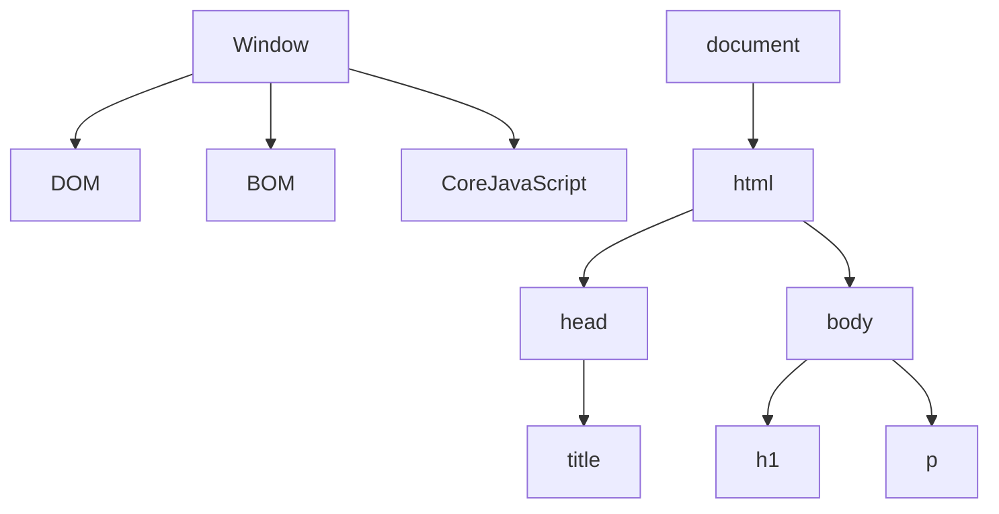
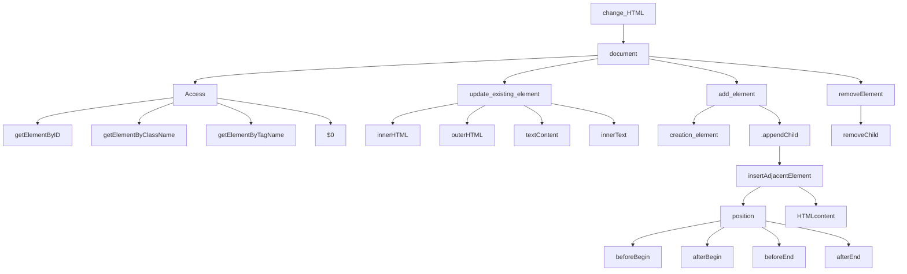
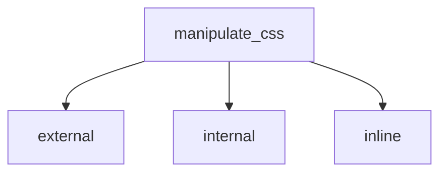

# Js DOM MANIPULATION

**Window Obj ---> global Obj** &nbsp;  &nbsp;    (sab kuch window object ke ander ata hain sab isi ke child hain)

**HTML code ---> convert javascript object  ---> document**

**HTML Tag  ---> Convert token ---> conver node ---> bunch of node is DOM**

## DOM Tree Structure


## DOM MANIPULATION
### Javascript code ke through ---> HTML ko manipulate karna

**documnet.querySelector("#id")**


> access element

- documnet.getElementById("#myid")
- document.getElementByClassName("myClass") &nbsp; &nbsp; &nbsp; // return HTML collection
- document.getElementByTagName("p")
- document.querySelector(".myclass")
- document.querySelectorAll(".myclass") &nbsp; &nbsp; &nbsp; // return node list

**Node list and HTML collection are not pure array (array like)**

> update element

- innerHTML
```javascript
const button = documnet.querySelector("#btn")
button.innerHTML = "<p>hello jee <p/>
```
- innerText
```javascript
   //jese  hum apne element to render karte ui pr same usi prkar humara innerHTML output dega
```
- textContent
```javascript
   // wo sara text content jo aap ke tag ke ander hota hain eg. tab /n
```

> add element

- create element
  ```javascript
     const heading = document.createElement("h1")
     heading.textContent = "my name is sidd"
  ```
- append element
  
  **child humesa end mein add ho rha hota hain**
  
  ```javascript
     const body = document.querySelector("body")
     body.appendChild(heading)
  ```
  
- insertAdjacentElement
  
  ```javascript
     let mydiv = document.querySelector("#mydiv);    // jis dive ke relative mein rkhna chate hain use select karna
     let newElement = document.createElement("span") // kon sa element rkhna hai
     mydiv.insertAdjacentHTML("beforebegin",newElement)
  ```
  
> remove element

```javascript
   const parent = document.querySelector("#mydiv")
   const child = document.querySelector("#mychild")
   parent.removeChild(child)
```
### Javascript code ke through ---> css manipulation



> inline style

 ```javascript
    para.style.backgroundColor = "black"                             // ek bar mein ek hi property ko change kar pata hunn
    para.style.cssText = "background-color: black; color: pink;"    // ek sath multiple style change kar sakta hunn
```
> setAttribute
```javascript
   const para = document.querySelector("p")
   para.setAttribute("class","myClass")
   para.setAttribute("style","padding: 1rem")
   para.className = "sidd raj"                      // class add karta hain
   para.classList                                   // return array like
   para.classList.add("myaddingclass")
   para.classList.remove("myclass")
   para.toggle("myClass")                           // return true and false class add or remove karega
   para.contains("myclass")                         // return true and false check present and absent
```

# Js Part 2 (project)
## click event (refer to BGCOLORCHANGER in root directory)
```javascript
let body = document.querySelector("body")
let btns = document.querySelectorAll(".buttons")

btns.forEach((btn)=>{
    btn.addEventListener("click",(e)=>{
        // console.log(e)
        // console.log(e.target)

        switch(e.target.id){
            case e.target.id : body.style.backgroundColor = e.target.id
            break;
            case e.target.id : body.style.backgroundColor = e.target.id
            break;
            case e.target.id : body.style.backgroundColor = e.target.id
            break;
            case e.target.id : body.style.backgroundColor = e.target.id;
            break;
            default : body.style.backgroundColor = "white"
        }
    })
})
```
## submit event (refer to BMI_CALCULATOR in root directory)
```javascript
let form = document.querySelector("form")


form.addEventListener("submit",(e)=>{
    e.preventDefault();
    const weight = parseInt(document.querySelector("#weight").value)
    const height = parseInt(document.querySelector("#height").value)
    const res =  document.querySelector("#result")


    if(weight === '' || weight < 0 || isNaN(weight)){
        res.textContent = "Please enter a valid weight"
    }else if (height=== '' || height<0 || isNaN(height)){
        res.textContent = "Please enter a valid height"
    }
    else{
    const result = (weight/((height*height)/10000)).toFixed(2)
    res.innerText = `RESULT : Your BMI is ${result}`
    }

})
```
## setInterval (refer to DIGITAL_CLOCK in root directory)
```javascript
   const time = document.querySelector(".time")

    setInterval(()=>{
        let date = new Date();
        time.innerHTML = date.toLocaleTimeString()
     },1000)
```
## GUESS_GAME (refer to GUESS_GAME in root directory)
```javascript
let random_num = parseInt((Math.random()*100)+1)
let user_input_Guess_num = document.querySelector("#guess_num")
let btn = document.querySelector("#sbmt")
let prevGuesses = document.querySelector(".prevGuesses")
let remaningCount = document.querySelector(".remaningCount")
let resultParameter = document.querySelector(".resultParameter")
let lowOrhigh = document.querySelector(".lowOrhigh")

let para = document.createElement("p")


let guess_values = []
let guess_number = 1

let playGame = true

if(playGame){
    btn.addEventListener("click",(e)=>{
        e.preventDefault()
        const in_Guess_value = parseInt(user_input_Guess_num.value)
        validateGuessValue(in_Guess_value)
    })
}

function validateGuessValue(in_Guess_value){
    if(isNaN(in_Guess_value)){
        alert("plese enter a valid number")
    }else if(in_Guess_value < 0){
        alert("plese enter a valid number")
    }else if(in_Guess_value > 100){
        alert("plese enter a valid number")
    }else{
        guess_values.push(in_Guess_value)
        if(guess_number === 10){
            displayGuessValues(in_Guess_value)
            displayMessage(`GameOver!. Random Number was ${random_num}` )
            endGame()
        }else{
            displayGuessValues(in_Guess_value)
            checkGuesses(in_Guess_value)
        }
    }
}

function checkGuesses(in_Guess_value){
    if(in_Guess_value === random_num){
        displayMessage("you win")
        endGame()
    }else if (in_Guess_value<random_num){
        lowOrhigh.textContent = "too low"
    }else {
        lowOrhigh.textContent = "too high"
    }
}

function displayGuessValues(in_Guess_value) {
    user_input_Guess_num.value=""
    prevGuesses.innerHTML += `${in_Guess_value}`
    guess_number++
    remaningCount.innerHTML = `${10-guess_number}`
}

function displayMessage(message) {
    lowOrhigh.innerHTML = `<h2>${message}</h2>`
}

function endGame(){
    user_input_Guess_num.value = ''
    user_input_Guess_num.setAttribute("disabled",'')
    para.classList.add("button")
    para.innerHTML = `<h2 id="newGame">Start New Game</h2>`
    resultParameter.appendChild(para)
    playGame = false
    newGame()
}

function newGame(){
    const new_game_btn = document.querySelector("#newGame")
    new_game_btn.addEventListener("click",function(){
    random_num = parseInt((Math.random()*100)+1)
    guess_values = []
    guess_number = 1
    prevGuesses.innerHTML = ''
    para.innerHTML = ''
    remaningCount.innerHTML = `${10-guess_number}`
    user_input_Guess_num.removeAttribute("disabled")
    resultParameter.removeChild(para)
    para.innerHTML = ''

    playGame = true
    

    })
}
```
# JAVASCRIPT_ADVANCED_CONCEPT
## EVENT
### inline ( onclick event )
```html
   <li></li>
   /* it is not feseable approach in large scale application to get problem */
```
   
   


