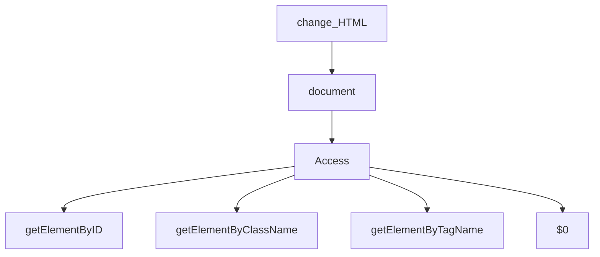

# Js DOM MANIPULATION

**Window Obj ---> global Obj** &nbsp;  &nbsp;    (sab kuch window object ke ander ata hain sab isi ke child hain)

**HTML code ---> convert javascript object  ---> document**

**HTML Tag  ---> Convert token ---> conver node ---> bunch of node is DOM**

## DOM Tree Structure

## DOM MANIPULATION
**Javascript code ke through ---> HTML ko manipulate karna**
**documnet.querySelector("#id")**

