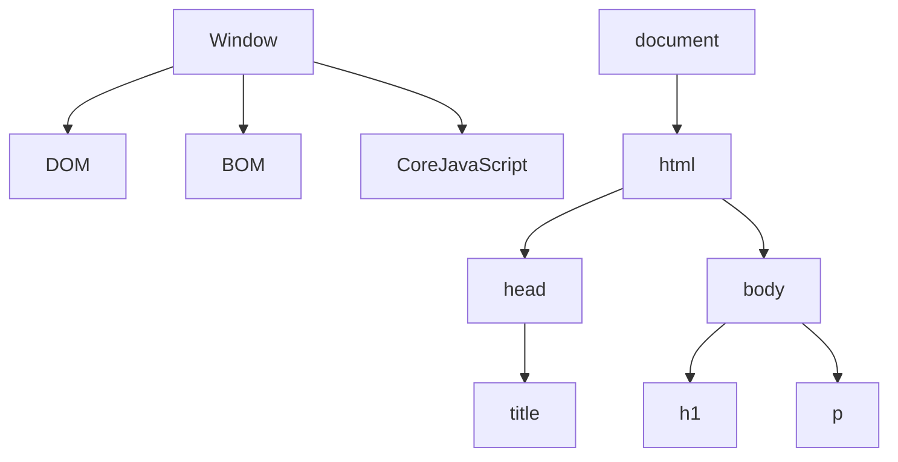
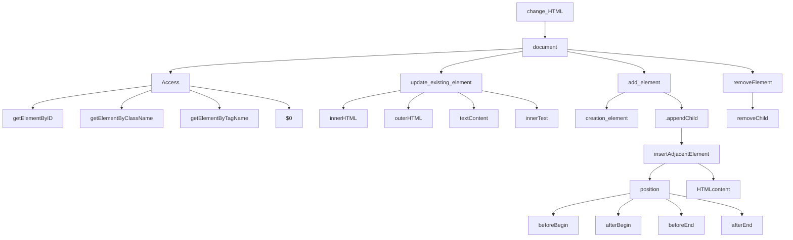
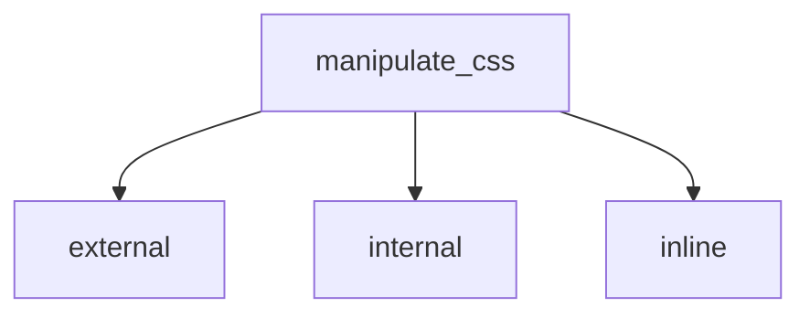
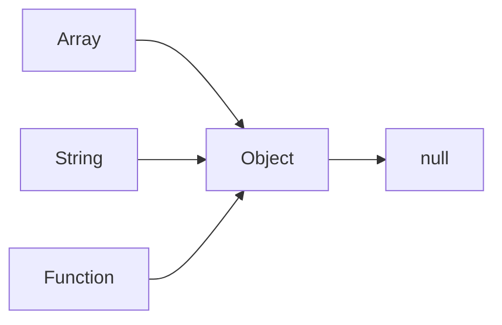

# JAVASCRIPT NOTES

## VARIABLE

i). let

ii) const &nbsp; &nbsp; &nbsp; (*ERROR assignment to const variable(Can't change variables once value is assigned)*) 

iii) var
> [!WARNING]
> prefer not to use var because of issue in block scope and functional scope

>[!IMPORTANT]
>"use strict"; &nbsp; &nbsp;    (*treat all js code as a new version*)
>
> alert(3+3)   &nbsp; &nbsp;  &nbsp;    (*ERROR, we are using nodejs,not browser*)


 ## DATATYPE  &nbsp;  &nbsp; (<small><small><small>_The way data is stored and accessed in memory, data types are similarly divided into two categories._<small/><small/><small/>)

EcmaScript [Read Docs](https://ecma-international.org/publications-and-standards/standards/ecma-262/).

1. Primitive  (call by value ( When called, a copy is returned.))
     - Number       --> range (2<sup>53</sup>)
     - Bigint      --> ```const num = 123456789n```
     - Boolean     --> true/false
     - String      --> ""
     - Null        --> standalone value   &nbsp; &nbsp; &nbsp; **typeof -->object
     - Undefined      &nbsp; &nbsp; &nbsp; &nbsp; &nbsp;  &nbsp; &nbsp; &nbsp; &nbsp; &nbsp; &nbsp; &nbsp; &nbsp; &nbsp; &nbsp; **typeof --> undefined
     - Symbol      --> unique

1. Non Primitive (Reference)  (call by reference ( When called, an address is returned.))
     - Object      &nbsp; &nbsp; &nbsp; **typeof --> object
     - Array       &nbsp; &nbsp; &nbsp; &nbsp; **typeof --> object
     - Function    &nbsp; &nbsp; **typeof --> function


## CONVERSION
```javascript
     let score =                         "77" || "77abc" || null || undefined
     let valueINNumber = Number(score)   ----    --------   ----    ---------
     console.log(valueINNumber)           77  ||   NaN   ||  0   ||   NaN

     let isLoggedIn =                               1    ||   0   || "sidd" || ""                        
     let booleanIsLoggedIn = Boolean(isLoggedIn)    ---     -----    ------    ---
     console.log(booleanIsLoggedIn)                 true || false ||  true  || false  
```

## OPERATIONS

+, -, /, *, **, %

```javascript
console.log(+true);     // 1
console.log(true+);     // error
console.log(+"");       // 0
```

## COMPARISON

 <, >, <=, >=, ==, !=
```javascript
console.log("2">1);          //true
console.log("02">1);         //true
console.log(null>0);         //false
console.log(null==0);        //false
console.log(null>=0);        //true
console.log(undefined>0);    //false
console.log(undefined==0);   //false
console.log(undefined>=0);   //false
```
=== strict check

## STACK AND HEAP MEMORY ALLOCATION IN JAVASCRIPT

The following code demonstrates how variables and objects are stored in the stack and heap memory in JavaScript.

```javascript
let myName = "siddharth";
let anotherName = "sidd";
anotherName = "skr";

console.log(myName);     // Output: siddharth
console.log(anotherName); // Output: skr

let userOne = { email: "sidd@gmail.com", username: "sidd" };
let userTwo = userOne;

userTwo.email = "siddharthkumarrai777@gmail.com";

console.log(userOne.email); // Output: siddharthkumarrai777@gmail.com
console.log(userTwo.email); // Output: siddharthkumarrai777@gmail.com

Stack and Heap Memory Diagram

Stack Memory:
Primitive(copy) values (like strings and numbers) and references to objects are stored in the stack memory.

Stack Memory:

| Variable      | Value                                      |                              
| ------------- | -------------------------------------------|
| myName        | "siddharth" (string)                       |
| anotherName   | "skr" (string)                             |
| userOne       | points to the object in the heap.          |
| userTwo       | points to the same object in the heap.     |

Heap Memory:
Non Primitive (References) Objects and complex data structures are stored in the heap memory.

Heap Memory:

| Address       | Object                                                        |
| ------------- | --------------------------------------------------------------|
| 0x001         | { email: "siddharthkumarrai777@gmail.com", username: "sidd" } |

Link Between Stack and Heap:

Stack Memory:
    | userOne  | ---> Reference to Heap (0x001) 
    | userTwo  | ---> Reference to Heap (0x001)

Heap Memory:
    0x001  --->  { email: "siddharthkumarrai777@gmail.com", username: "sidd" }
```

## STRING
```javascript
     const name = "siddharth"
     const repoCount = 50
     console.log(`hello my name is ${name} and my repocount is ${repoCount}  // Template Literals:

     const gamename = new String("pubg")
     console.log(gamename[0]); // p
     console.log(gamename.__proto__);  node {} | browser String {'', anchor: ƒ, at: ƒ, big: ƒ, blink: ƒ, …}

     1. String Key Concepts

        let str = "Hello World";

      - String Properties:

         console.log(str.length);  // Output: 11

      - Common String Methods:

         console.log(str.charAt(1));         // Output: 'e'
         console.log(str.indexOf('l'));      // Output: 2
         console.log(str.slice(1, 4));       // Output: 'ell'
         console.log(str.substring(1, 4));   // Output: 'ell'
         console.log(str.toUpperCase());     // Output: 'HELLO WORLD'
         console.log(str.replace('H', 'J')); // Output: 'Jello World'
         console.log(sentence.split(' '));   // Output: ['Hello', 'World']
         console.log(str.trim());            // Output: 'HelloWorld'

       - String are Immutable:

           str[0] = "J";      // Does nothing
           console.log(str);  // Output: 'Hello World'
```
## NUMBERS
```javascript
    
    const score = 400
    console.log(score) //400   **typeof number

    const balance = new Number(100)
    console.log(balance)   // node [Number: 400]  // browser Number {400} [[Prototype]]: Number [[PrimitiveValue]]: 400


    - Numbers Methods:

      console.log(balance.toString().length);       // 3
      console.log(balance.toFixed(2));              // 100.00
      console.log(balance.toPrecision(4));          // "100.0"
      console.log(balance.toLocaleString("en-IN")); // 10,000
      console.log(balance.toExponential(1));        // "1.0e+2"

    - Checking if values are finite, integers, or NaN

      console.log(Number.isFinite(balance));    // true
      console.log(Number.isInteger(balance));   // true
      console.log(Number.isNaN(balance));       //false
```
## MATHS
```javascript
      console.log(Math);            // node Object [Math] {}  // browser Math {abs: ƒ, acos: ƒ, acosh: ƒ, asin: ƒ, asinh: ƒ, …}

      console.log(Math.abs(-4));    //  4
      console.log(Math.round(4.6))  //  5
      console.log(Math.ceil(4.2))   //  5
      console.log(Math.floor(4.9))  //  4
      console.log(Math.min(4,3,7))  //  3
      console.log(Math.max(7,9,2))  //  9

      console.log(Math.random())    //  return random number between 0 and 1
      console.log(Math.random()*10)
      console.log((Math.random()*10)+1)
      console.log(Math.floor(Math.ramdom()*10)+1))

      const min = 10
      const max = 20
      Math.floor(Math.random()*(max-min+1))+min
```
## DATES
```javascript

   let myDate = new Date()
   console.log(typeof myDate)            // object
   console.log(myDate);                  // 2024-08-25T06:20:03.401Z
   console.log(myDate.toString());       // Sun Aug 25 2024 11:51:40 GMT+0530 (India Standard Time)
   console.log(myDate.toDateString());   // Sun Aug 25 2024
   console.log(myDate.toLocaleString()); // 25/8/2024, 11:54:33 am

   let myCreatedDate = new Date(2023,0(month),24)
   console.log(myCreatedDate)            // 2023-01-23T18:30:00.000Z

   let myTimeStamp = Date.now()
   console.log(myTimeStamp)              // 1724567383704 (in millisecond from January 1, 1970, UTC)
   console.log(myCreatedDate.getTime())  // 1674498600000 (in millisecond from January 1, 1970, UTC)
 
   console.log(Math.floor(Date.now()/1000(second)))  // 1724567740 (time in second)

   let newDate = new Date()
   console.log(newDate);                  //  2024-08-25T06:37:56.966Z
   console.log(newDate.getMonth())        //  7

   newDate.toLocaleString('default',{weekday: "long"})

```
## ARRAYS
```javascript
   const myArr = [0,1,23,true,"sidd",null,undefined]
   const myArr2 = new Array(0,1,2,3,4,5)
   console.log(myArr2)                    // [ 0, 1, 2, 3, 4, 5 ]

 - Adding/Removing Elements (Mutation method)

   myArr2.push(6)                         // [ 0, 1, 2, 3, 4, 5, 6]
   myArr2.pop()                           // [ 0, 1, 2, 3, 4, 5 ]
   myArr2.unshift(9)                      // [ 9, 0, 1, 2, 3, 4, 5 ]
   myArr2.shift()                         // [ 0, 1, 2, 3, 4, 5 ]

- Accessing Elements

  myArr2.indexOf(2));                     // Output: 2  (not found -1)
  myArr2.lastIndexOf(2));                 // Output: 2
  myArr2.includes(9)                      // output: false

- Manipulating Elements

   const myArr2 = new Array(0,1,2,3,4,5)
   console.log(myArr2)                    // [ 0, 1, 2, 3, 4, 5 ]

   myArr2.splice(1(start_index),2(how many remove),4(which element you want add))   // return [ 1, 2 ]             // original array [ 0, 4, 3, 4, 5 ]

   console.log([1, 2, 3].reverse());              // Output: [3, 2, 1]
   console.log([3, 2, 1].sort());                 // Output: [1, 2, 3]
   console.log([1, 2, 3].fill(4));                // Output: [4, 4, 4]
   console.log([1, 2, 3, 4, 5].copyWithin(0, 3)); // Output: [4, 5, 3, 4, 5]

   copyWithin(0, 3) ka matlab hai:
   - Target: 0 (ye woh index hai jahan par elements ko paste karna hai)
   - Start: 3 (ye woh index hai jahan se elements ko copy karna hai)
   - End (optional): Ye woh index hai jahan tak elements ko copy karna hai. Agar end nahi diya jaye, toh array ke last element tak copy hoga.

- String Conversion

  myArr2.join("-");                       // Output: "0-1-2-3-4-5"

- Iteration

  const myArr2 = new Array(0,1,2,3,4,5)
  console.log(myArr2)                                // [ 0, 1, 2, 3, 4, 5 ]

  myArr2.forEach((element) => console.log(element)); // Output: 0, 1, 2, 3, 4, 5
  myArr2.map((element) => element * 2))              // Output: 0, 2, 4, 6, 8, 10
  myArr2.filter((element) => element > 1));          // Output: [2, 3, 4, 5]
  myArr2.reduce((acc, element) => acc + element));   // Output: 15

- ADVANCED CONCEPT

  const marvel_heros = ["thor","ironman","spider"]
  const dc_heros = ["super","flash","batman"]

  marvel_heros.push(dc_heros)                           // return size 4
  console.log(marvel_heros)                             // [ 'thor', 'ironman', 'spider', [ 'super', 'flash', 'batman' ] ]
  console.log(dc_heros)                                 // [ 'super', 'flash', 'batman' ]

  const all_heros = marvel_heros.concat(dc_heros);      // return : [ 'thor', 'ironman', 'spider', 'super', 'flash', 'batman' ]
  const all_new_heros = [...marvel_heros, ...dc_heros]  // return : [ 'thor', 'ironman', 'spider', 'super', 'flash', 'batman' ]

  const anotherArr = [1,2,3,[4,5,6],7,[6,7[4,5]]]
  const real_anotherArr = anotherArr.flat(Infinity)     // return : [ 1, 2, 3, 4, 5, 6, 7, 6, 7, 4, 5]

  console.log(Array.isArray("siddharth"))               // false
  console.log(Array.from("siddharth"))                  // ['s', 'i', 'd', 'd', 'h', 'a', 'r', 't', 'h']
  console.log(Array.from({name: "siddharth"}))          // []

  let one = 100
  let two = 200
  let three = 300
  console.log(Array.of(one,two,three))                   // [ 100, 200, 300 ]
```
## OBJECTS
```javascript
   - singleton  (constructor se humesa singleton banega)
        Object.create()
        const tinderUser = new Object()

   - object literals (literal se humesa singleton nahi bnega)
         const tinderUser = {}
     
        const mySym = Symbol("key1")
        const jsUser = {
                name: "siddharth",
                age: 19,
                location: "delhi",
                email: "sidd@gmail.com",
                isLoggdIn: false,
                lastLoginDays: ["monday","saturday"],
                "full Name": "siddharth kumar rai",
                [mySym]: "mykey1"
        }

        console.log(jsUser.email)                       // sidd@gmail.com
        console.log(jsUser["email"])                    // sidd@gmail.com
        console.log(jsUser["full Name"])                // siddharth kumar rai
        console.log(jsUser[mySym])                      // mykey1
        console.log(Object.keys(jsUser))                // ['name', 'age', 'location', 'email', 'isLoggdIn', 'lastLoginDays', 'full Name']
        console.log(Object.values(jsUser))              // ['siddharth',19,'delhi','sidd@gmail.com',false,[ 'monday', 'saturday' ],'siddharth kumar rai']
        console.log(Object.entries(jsUser))             // [[ 'name', 'siddharth' ],[ 'age', 19 ],[ 'location', 'delhi' ],[ 'email', 'sidd@gmail.com' ],[ 'isLoggdIn', false ],
                                                            [ 'lastLoginDays', [ 'monday', 'saturday' ] ],[ 'full Name', 'siddharth kumar rai' ]]
        console.log(jsUser.hasOwnProperty("isLoggedIn") // true

        jsUser.greeting = function hello() {
            console.log(`hello ${this.name}`);
        }
        jsUser.greeting()                                // hello siddharth

        Object.freeze(jsUser)                            // object ki property and method ko change nahi karne dega

       const obj1 = {1:"a", 2:"b"}
       const obj2 = {3:"a", 4:"b"}
       const obj3 = {obj1,obj2}
       console.log(obj3)                                  // { obj1: { '1': 'a', '2': 'b' }, obj2: { '3': 'a', '4': 'b' } }

       const obj3 = Object.assign({},obj1,obj2)           // { '1': 'a', '2': 'b', '3': 'a', '4': 'b' }  (**agar {} ye nahi dete to sri value obj1 mein ja rahi hain)
       const obj3 = {...obj1, ...obj2}                    // { '1': 'a', '2': 'b', '3': 'a', '4': 'b' }

     - DeStructuring
       const {name} = jsUser
       console.log(name)                                  // siddharth
       const {name: fullName} = jsUser
       console.log(fullName)                              // siddharth           

```
## FUNCTION
```javascript

   function addTwoNumber(number1,number2){                // number1 and number2 are parameter  (function defination)
        console.log(number1+number2)
   }

   addTwoNumber(3,4)                                      // 3,4 are argument  (function call)

   function loginUserMessage(username){
        return `${username} Just loggedin`
   }
   console.log(loginUserMessage("siddharth"))            // siddharth Just loggedin

  function calculateCartPrice(num1){
       return num1
  }
  console.log(calculateCartPrice(200))                   // 200

  function calculateCartPrice(...num1){                  // ...num1 is parameter ko rest bolte hain
      return num1
  }
  console.log(calculateCartPrice(200,500,700))           // [200,500,700]

  const jsUser = {
         username: "siddharth"
  }
  function handelObject(someobj){
       console.log(someobj.username)
  }
  handelObject(jsUser)                                    // siddharth

```
## SCOPE
```javascript
   node -----> global scope {}
   browser --> global scope window{}

   if(true){
       let a = 10
       const b = 20
       var c = 30
   }
   console.log(a)    // a is not defined
   console.log(b)    // b is not defined
   console.log(c)    // c is not defined

   - Nested Scope
   Closer --> ander ka function bhar ke function ke variable ko access kar pata hain

   function one(){
        const username = "siddharth"
        function two(){
             const website = "https:github.com"
             console.log(username)                  // siddharth
        }
        console.log(website);                       // ERROR : website is not defined

        two()
   }
   one()

   console.log(addOne(5))                                  // 6
   function addOne(num){
       return num+1
   }

   console.log(addTwo(5)                                  // Error : can't access 'addTwo' before initialize 
   const addTwo = function(num)                           // function expression
       return num+2
   }

   - Arrow Function
     const user = {
            username: "siddharth kumar rai",
            welcomeMessage: function(){
                  console.log(`${this.username},welcome`);  
            }
            console.log(this)                               // { username: 'siddharth kumar rai', welcomeMessage: [Function: welcomeMessage] }
    }
    user.welcomeMessage()                                   // siddharth kumar rai,welcome
    user.username = "sidd
    user.welcomeMessage()                                   // sidd,welcome

    console.log(this)                                       // node empty {}  // browser global object window object

    function sidd(){
        let username = "siddharth"
        console.log(this.username);                         // undefined
        console.log(this)                                   // <ref *1> Object [global] {etc.}
   }
   sidd()

   const sidd = ()=>{
      let username = "siddharth",
      console.log(this.username}                            // undefined
      console.log(this)                                     // {}
   }
```
>[!IMPORTANT]
> { } &nbsp; &nbsp;   <--------- likha to return likhna padega
>
> ( ) &nbsp; &nbsp;  <---------- return nahi likna padega

> Explicit and Implicit return

```javascript

- Explicit Return

  const addTwo = (num1,num2) => {
         return num1+num2
  }
  console.log(addTwo(3,4))   // 7

 - Implicit Return

    const addTwo = (num1,num2) => num1 + num2
                               => (num1 + num2)

   const addTwo = (num1,num2) => {user: "sidd"}
   console.log(addTwo(5,6))                            // undefined
   
   const addTwo = (num1,num2) => ({user: "sidd"})
   console.log(addTwo(5,6))                            // { user: 'sidd' }
```
## IMMEDIATELY_INVOKED_FUNCTION_EXPRESSION (IIFE)
```JAVASCRIPT
- Named IIFE
(Function sidd(){
       console.log(`DB CONNECTED`)
}} ();                                                 // ; semicolon lagana mandatory hain

- Without Named IIFE
(()=>{
  console.log(`DB CONNECTED`)
})();
```
## JAVASCRIPT_EXECUTION_CONTEXT

   { } ----> Global Execution Context (refer this)

> In Javascript 3 types of Execution Context
   - Global Execution Context
   - Function Execution Context
   - Eval Execution Context

> The Execution Context Done In Three Phase
   - Global Execution (refer this)
   - Memory Creation Phase
   - Execution Phase


> Test it yourself in the browser (javascript execution)
  - Browser --> source --> +New Snippet(click) make script.js
    ```javascript
       script.js
       function one(){
            console.log("one")       // add break point
       }
    
       function two(){
            console.log("one")      // add break point
       }
    
       function three(){
            console.log("one")      // add break point
       }
       one()
       two()
       three()

       function one(){
            console.log("one")       // add break point
            two()
       }
    
       function two(){
            console.log("one")      // add break point
            three()
       }
    
       function three(){
            console.log("one")      // add break point
       }
       one()
```
```
## CONTROL_FLOW

| if                   |  if , else              | if / else if / else                  | switch                  |
|----------------------|-------------------------|--------------------------------------|-------------------------|
|                      |                         |                                      |                         |
| if ( true ) {        |  if ( false ) {         |    if(false){                        |    switch(key){         |
|    execute code      |     not execute code    |         not execute code             |        case value:      |
| }                    |  } else {               |    } else if ( true ) {              |              code       |
|                      |       execute this      |          execute code                |              break;     |
|                      | }                       |    } else {                          |                         |
|                      |                         |         if(false),else if(false),    |       default:          |
|                      |                         |           execute code               |             code        |
|                      |                         |    }                                 |             break;      |
|                      |                         |                                      |     }                   |
|                      |                         |                                      |                         |


** agar break; nahi lgaya to us condition jha match hogi uske bad sare code execute hoga except default
** continue jha condition match hui us condition ko skip kar do bas

- truthy values ( "0" , 'false' , "space" , [ ] , { } , function ( ) { } )
- falsy values  ( false , 0 , -0 , BigInt0n , "" , null , undefined , NaN )

## NULLISH COALESCING OPERATOR ?? UNDEFINED / NULL
```javascript
   let val1;
   val1 = 5??10
   console.log(val1); // 5

   val1 = null??10
   console.log(val1); // 10

   val1 = undefined??15
   console.log(val1); // undefined

   val1 = null??10??15
   console.log(val1)
```
## TERNERARY OPERATOR
**condition ? true : false**

## Map
> Map ek data structure hai jo key-value pairs ko store karta hai.
```javascript
   const map = new Map()
   map.set("IN","India")
   map.set("USA","united states of America")

   console.log(map)                           // Map(2) { 'IN' => 'India', 'USA' => 'united states of America' }
```

## ITERATIONS
> loops
  - for loop
    ```javascript

        let arr = [ "super" "batman", "spider" ]
    
        for(let index = 0; index < arr.length; index++) {
              const element = arr[index];
              console.log(element)
        }
    ```
  - while loop
    ```javascript

        let index = 0;                     // initialization
    
        while(condition){
              console.log("sidd")
              index++                     // incremant/decrement
        }
    ```
  - do while loop
    ```javascript

        let index = 0;                     // initialization
    
        do {
              console.log("sidd")
              index++                     // incremant/decrement
        }while(condition);
    ```
    
    > for of loops &nbsp; &nbsp; &nbsp; &nbsp; // (array specific) ,&nbsp; (don't use in objects,error aaygi object are not iterable) ,&nbsp; (Map data structure pr lag jayega key value pair ka array 
       return karega)
    
      ```javascript
      
         const arr = [1,2,3,4,5]

         for( const num of arr) {
            console.log(num)                        // 1 2 3 4 5   
         }

        const map = new Map()
        map.set("IN","India")
        map.set("USA","united states of America")

       for (const [key,value] of map) {
         console.log(`${key}:- ${value}`)          // IN:- India USA:- united states of America
      }

      ```
      > for in loop &nbsp; &nbsp; (object specific) &nbsp; &nbsp; (array pr bhi laga skte hain) &nbsp; &nbsp; (map pr iterate nahi hota or error bhi nahi aati)
       
      ```javascript
     
           const obj = {
              js : "jaavascript",
              py : "python"
           }

           for (const key in obj){
              console.log(key)                                //  js py

           }
      ```
    > foreach, filter, map, reduce
      - myArr2.forEach((element) => console.log(element))&nbsp; &nbsp; // Output: 0, 1, 2, 3, 4, 5  &nbsp; &nbsp;  // return nahi karta      &nbsp; &nbsp; // 3 parameter le skta hain (item,index,array)
      - myArr2.map((element) => element * 2))            &nbsp; &nbsp; // Output: 0, 2, 4, 6, 8, 10 &nbsp; &nbsp;  // value return karta hain
      - myArr2.filter((element) => element > 1));        &nbsp; &nbsp; // Output: [2, 3, 4, 5]      &nbsp; &nbsp; // value return karta hain
      - myArr2.reduce((acc, element) => acc + element)); &nbsp; &nbsp; // Output: 15                &nbsp; &nbsp; // value return karta hain

# Js DOM MANIPULATION

**Window Obj ---> global Obj** &nbsp;  &nbsp;    (sab kuch window object ke ander ata hain sab isi ke child hain)

**HTML code ---> convert javascript object  ---> document**

**HTML Tag  ---> Convert token ---> conver node ---> bunch of node is DOM**

## DOM Tree Structure


## DOM MANIPULATION
### Javascript code ke through ---> HTML ko manipulate karna

**documnet.querySelector("#id")**


> access element

- documnet.getElementById("#myid")
- document.getElementByClassName("myClass") &nbsp; &nbsp; &nbsp; // return HTML collection
- document.getElementByTagName("p")
- document.querySelector(".myclass")
- document.querySelectorAll(".myclass") &nbsp; &nbsp; &nbsp; // return node list

**Node list and HTML collection are not pure array (array like)**

> update element

- innerHTML
```javascript
const button = documnet.querySelector("#btn")
button.innerHTML = "<p>hello jee <p/>
```
- innerText
```javascript
   //jese  hum apne element to render karte ui pr same usi prkar humara innerHTML output dega
```
- textContent
```javascript
   // wo sara text content jo aap ke tag ke ander hota hain eg. tab /n
```

> add element

- create element
  ```javascript
     const heading = document.createElement("h1")
     heading.textContent = "my name is sidd"
  ```
- append element
  
  **child humesa end mein add ho rha hota hain**
  
  ```javascript
     const body = document.querySelector("body")
     body.appendChild(heading)
  ```
  
- insertAdjacentElement
  
  ```javascript
     let mydiv = document.querySelector("#mydiv);    // jis dive ke relative mein rkhna chate hain use select karna
     let newElement = document.createElement("span") // kon sa element rkhna hai
     mydiv.insertAdjacentHTML("beforebegin",newElement)
  ```
  
> remove element

```javascript
   const parent = document.querySelector("#mydiv")
   const child = document.querySelector("#mychild")
   parent.removeChild(child)
```
### Javascript code ke through ---> css manipulation



> inline style

 ```javascript
    para.style.backgroundColor = "black"                             // ek bar mein ek hi property ko change kar pata hunn
    para.style.cssText = "background-color: black; color: pink;"    // ek sath multiple style change kar sakta hunn
```
> setAttribute
```javascript
   const para = document.querySelector("p")
   para.setAttribute("class","myClass")
   para.setAttribute("style","padding: 1rem")
   para.className = "sidd raj"                      // class add karta hain
   para.classList                                   // return array like
   para.classList.add("myaddingclass")
   para.classList.remove("myclass")
   para.toggle("myClass")                           // return true and false class add or remove karega
   para.contains("myclass")                         // return true and false check present and absent
```

# Js Part 2 (project)
## click event (refer to BGCOLORCHANGER in root directory)
```javascript
let body = document.querySelector("body")
let btns = document.querySelectorAll(".buttons")

btns.forEach((btn)=>{
    btn.addEventListener("click",(e)=>{
        // console.log(e)
        // console.log(e.target)

        switch(e.target.id){
            case e.target.id : body.style.backgroundColor = e.target.id
            break;
            case e.target.id : body.style.backgroundColor = e.target.id
            break;
            case e.target.id : body.style.backgroundColor = e.target.id
            break;
            case e.target.id : body.style.backgroundColor = e.target.id;
            break;
            default : body.style.backgroundColor = "white"
        }
    })
})
```
## submit event (refer to BMI_CALCULATOR in root directory)
```javascript
let form = document.querySelector("form")


form.addEventListener("submit",(e)=>{
    e.preventDefault();
    const weight = parseInt(document.querySelector("#weight").value)
    const height = parseInt(document.querySelector("#height").value)
    const res =  document.querySelector("#result")


    if(weight === '' || weight < 0 || isNaN(weight)){
        res.textContent = "Please enter a valid weight"
    }else if (height=== '' || height<0 || isNaN(height)){
        res.textContent = "Please enter a valid height"
    }
    else{
    const result = (weight/((height*height)/10000)).toFixed(2)
    res.innerText = `RESULT : Your BMI is ${result}`
    }

})
```
## setInterval (refer to DIGITAL_CLOCK in root directory)
```javascript
   const time = document.querySelector(".time")

    setInterval(()=>{
        let date = new Date();
        time.innerHTML = date.toLocaleTimeString()
     },1000)
```
## GUESS_GAME (refer to GUESS_GAME in root directory)
```javascript
let random_num = parseInt((Math.random()*100)+1)
let user_input_Guess_num = document.querySelector("#guess_num")
let btn = document.querySelector("#sbmt")
let prevGuesses = document.querySelector(".prevGuesses")
let remaningCount = document.querySelector(".remaningCount")
let resultParameter = document.querySelector(".resultParameter")
let lowOrhigh = document.querySelector(".lowOrhigh")

let para = document.createElement("p")


let guess_values = []
let guess_number = 1

let playGame = true

if(playGame){
    btn.addEventListener("click",(e)=>{
        e.preventDefault()
        const in_Guess_value = parseInt(user_input_Guess_num.value)
        validateGuessValue(in_Guess_value)
    })
}

function validateGuessValue(in_Guess_value){
    if(isNaN(in_Guess_value)){
        alert("plese enter a valid number")
    }else if(in_Guess_value < 0){
        alert("plese enter a valid number")
    }else if(in_Guess_value > 100){
        alert("plese enter a valid number")
    }else{
        guess_values.push(in_Guess_value)
        if(guess_number === 10){
            displayGuessValues(in_Guess_value)
            displayMessage(`GameOver!. Random Number was ${random_num}` )
            endGame()
        }else{
            displayGuessValues(in_Guess_value)
            checkGuesses(in_Guess_value)
        }
    }
}

function checkGuesses(in_Guess_value){
    if(in_Guess_value === random_num){
        displayMessage("you win")
        endGame()
    }else if (in_Guess_value<random_num){
        lowOrhigh.textContent = "too low"
    }else {
        lowOrhigh.textContent = "too high"
    }
}

function displayGuessValues(in_Guess_value) {
    user_input_Guess_num.value=""
    prevGuesses.innerHTML += `${in_Guess_value}`
    guess_number++
    remaningCount.innerHTML = `${10-guess_number}`
}

function displayMessage(message) {
    lowOrhigh.innerHTML = `<h2>${message}</h2>`
}

function endGame(){
    user_input_Guess_num.value = ''
    user_input_Guess_num.setAttribute("disabled",'')
    para.classList.add("button")
    para.innerHTML = `<h2 id="newGame">Start New Game</h2>`
    resultParameter.appendChild(para)
    playGame = false
    newGame()
}

function newGame(){
    const new_game_btn = document.querySelector("#newGame")
    new_game_btn.addEventListener("click",function(){
    random_num = parseInt((Math.random()*100)+1)
    guess_values = []
    guess_number = 1
    prevGuesses.innerHTML = ''
    para.innerHTML = ''
    remaningCount.innerHTML = `${10-guess_number}`
    user_input_Guess_num.removeAttribute("disabled")
    resultParameter.removeChild(para)
    para.innerHTML = ''

    playGame = true
    

    })
}
```
# JAVASCRIPT_EVENT_ADVANCED_CONCEPT
## EVENT (refer to EVENT in root directory)
### 1.) inline ( onclick event )
```html
   <li></li>

   // it is not feseable approach in large scale application to get problem 
```
### 2.) Approach 2 ( onclick event )
```javascript
    document.querySelector("#tourtle").onclick = ()=>{
         alert("Turtle clicked");
         console.log("tourtle was clicked");
     }
    // give very less information,features
```
### 3.) Approach 3 addEventListener ( onclick event )
```javascript
   document.querySelector("#images").addEventListener("click",(e)=>{
            console.log(e)
   },false)

    // attachEvent()
    // jQuery - on

    // type, timestamp, defaultPrevented
    // target, toElement, srcElement, currentTarget,
    // clientX, clientY, screenX, screenY
    // altkey, ctrlkey, shiftkey, keyCode
```
## event propagation 
```javascript
   addEventListener("click",(e)=>{
            console.log(e)
   },false)
```
> It have two context
- event bubbling (default false parameter ) (inside to outside propagations)
- event capturing (true parameter ) (outside to inside )
```javascript
        document.querySelector("#images").addEventListener("click",(e)=>{
             console.log("clicked inside the ul a");
         },false)
         document.querySelector("#tourtle").addEventListener("click",(e)=>{
            console.log("tourtle was clicked b");
            e.stopPropagation()                   // not bubbling 
          },false)
```
>  e.stopPropagation()                   // not bubbling

>  e.preventDefault()                    // Don't go to the URL

- real scenario
```javascript
        document.querySelector("#images").addEventListener("click",(e)=>{
            if(e.target.tagName === 'IMG'){
                let removeElement = e.target.parentNode
                // removeElement.parentNode.removeChlid(removeElement)
                removeElement.remove()
            }
         })
```
# JAVASCRIPT_ADVANCED_CONCEPT
## JAVASCRIPT_ASYNC_CODE


> setTimeOut function and clear TimeOut function
```HTML
        <button id="stop">STOP</button>
```
```javascript
        let setTimeOutId = setTimeout(()=>{
            console.log("siddharth kumar rai")
        },2000);
        document.getElementById("stop").addEventListener("click",function(){
            clearTimeout(setTimeOutId)
        })
```
> setInterval function and clearInterval function
```HTML
        <button id="start">START</button>
        <button id="stop">STOP</button>
```
```javascript
        let resetInterval;
        const sayName = function(str){
            console.log(str,Date.now())
        }
        document.querySelector("#start").addEventListener("click",(str)=>{
        resetInterval = setInterval(sayName,1000,"hii")
        })
        document.querySelector("#stop").addEventListener("click",function(){
            clearInterval(resetInterval)
        })
```
#### ONCLICKBGCHANGER (refer to BGCOLORCHANGER in root directory)
## api request (XMLHTTP request)
```javascript
        let githubApi = "https://api.github.com/users/siddharthkumarrai"
        // 0	UNSENT	Client has been created. open() not called yet.
        let xhr = new XMLHttpRequest()
        // 1	OPENED	open() has been called.
        xhr.open("GET", githubApi, true)
        console.log("OPENED CALLED", xhr.readyState)
        // 2	HEADERS_RECEIVED	send() has been called, and headers and status are available.
        xhr.send()
        console.log("SEND CALLED", xhr.HEADERS_RECEIVED)
        // 3	LOADING	Downloading; responseText holds partial data.
        xhr.onprogress = () => {
            console.log("LOADING", xhr.readyState)
        }
        // 4	DONE	The operation is complete.
        xhr.onload = ()=>{
            console.log("DONE",xhr.readyState)
        }
        //arrow function ke andar this.responseText nahi use kar sakte response json me parse nahi hota
        xhr.onreadystatechange = ()=>{
            if (xhr.readyState === 4) {
                let res = xhr.response   // string response
                let objdata = JSON.parse(res)
                console.log(typeof objdata)
                console.log(objdata);
                let name = document.querySelector("h1");
                let image = document.querySelector("img");
                name.innerText = objdata.login;
                image.src = objdata.avatar_url  
            }
        }

        // classical function mein this.response likh sate hain
        // xhr.onreadystatechange = function () {
             if(xhr.readyState === 4){
                 let data = this.responseText
                 console.log(data)
             }      
            }
```
## promises
> Method 1
- How to create promise
  ```javascript
  let promiseOne = new Promise(function(resolve,reject){
        //async task
        setTimeout(function(){
            console.log("siddharth kumar rai")
            resolve()
        },1000)
  })
  ```
- How to consume promise
```javscript
    promiseOne.then(function(){
        console.log("promise was consumed")
    })
```
> Method 2
```javscript
    new Promise(function(resolve,reject){
        setTimeout(function(){
            console.log("Db connected 2")
            resolve()
        },1000)
    }).then(function(){
        console.log("promise two consumed")
    })
```
> Method 3
```javascript
    et promiseThree = new Promise(function(resolve,reject){
    setTimeout(function(){
        console.log("new DB CONNECTED 3");
        resolve({username:"siddharth", id: 123})
        
    },1000)
})

promiseThree.then(function(data){
    console.log(data)
})
```
> Method 4
```javascript
    let promiseFour = new Promise(function(resolve,reject){
        setTimeout(function(){
            let error = true
            if(!error){
                console.log("DB connected 4" )
                resolve({languageName: "javaScript", id: "js"})
            }else {
                reject("error 404")
            }
        },1000)
    })

    promiseFour.then(function(data){
        console.log("promise four consumed")
        return data.languageName
    }).then(function(username){
        console.log(username)
    })
    .catch(function(error){
        console.log(error,"something went wrong")
    })
    .finally(function(){
    console.log("if promise was resolved then executed otherwise nor resolved then also executed")
    })
```
> Method 5 ( using async await )
```javascript
let promiseFive = new Promise(function(resolve,reject){
    setTimeout(function(){
        let error = false
        if(!error){
            console.log("DB connected 5")
            resolve({languageName: "python",id:"py"})
        }else{
            reject("error 502")
        }
    },1000)
})

async function consumedPromiseFive(){
    try {
    const response = await promiseFive
    console.log(response)
    } catch (error) {
        console.log(error)
    }
}

consumedPromiseFive()

```
## api data handle (api fetch method)
```javascript
        async function getAllUser(){
            try {
              const response = await fetch("https://jsonplaceholder.typicode.com/users")
              const data = await response.json()

              console.log(data)
            } catch (error) {
                console.log(error)
            }
        }

        getAllUser()

        fetch("https://api.github.com/users/siddharthkumarrai")
        .then(function(data){
            let res = data.json()
            return res
        })
        .then(function(result){
            console.log(result)
        }).catch(function(error){
            console.log(error)
        })

// promise.all
// yes this is also available, kuch reading aap b kro.
```
# Classes and OOP
## javascript and classes
### OOP ( programming paradigm ( code likh ne ka structure kya style producer ) )
> Object
- collection of property and methods e.g toUpperCase
> why we use OOP
- code bada messup ho raha tha (concept of spagti code( code reuse nahi ho pa rha tha ))
> parts of OOP
- Object literall
- OOP keywords
  - Constructor function
  - Prototypes
  - Classes
  - Instances (new, this)
> 4 pillars
- Abstraction ( Details hide karlena e.g fetch )
- Encapsulation ( ek wrapper lagana jo jo aap ko access karne deya jaye wo aap access kar paa rahe hain jo nahi karne de raha access nahi kar pa rahe hain)
- Inheritance
- Polymorphism ( ek hi mthod bhut sare kam kar deta hain )

## OOP
> Object literal ( basic unit )
```javascript
   const user = {
        username: "siddharth",
        loginCount: 7,
        signedIn: true,

        getUserDetails: function(){
                console.log(`Username: ${this.username}`)
                console.log(this)        
        }
   }
   console.log(user.name)
   console.log(user.getUserDetails())
   console.log(this)                // {}
```
## constructor
- constructor function ( new keyword ) (in single instance create multiple object )
```javascript
   const promiseOne = new Promise()
   const date new Date()

   function user( username, loginCount, isLoggedIn ){
        this.username = username;
        this.loginCount = loginCount;
        this.isLoggedIn = isLoggedIn;

        return this
   }

   const userOne = new user("siddharth", 7, true)
   const userTwo = new user("abhishek", 17, false)
   console.log(userOne)
   console.log(userOne.constructor) (refrence hota hain khud ke bare mein)
```
- how new keyword work
  - step 1: new object create
  - step 2: constructor function call hota hain new keyword ke karn ye sare argument ko pack kar ke de deta hain
  - step 3: all argument inject in this keyword
  - step 4: function ke ander mil jate hain
## new keyword 
- default behavior of Javascript is prototypal behavior
- Object

  ```javascript
     function multiplyBy7(num){
          return num*7
     }
  
     multiplyBy7.power = 2

     console.log(multiplyBy7(8))          // 56
     console.log(multiplyBy7.power)       // 2
     console.log(multiplyBy5.prototype)   // {} prototype us method ka this hain

     function user(username, score) {
        this.username = username
        this.score = score
     }

     user.prototype.increment = function(){
                this.score++
     }

     user.prototype.printScore = function(){
                console.log(`the score is ${this.score}`)
     }

     const userOne = new user("sidd",77)
     const userTwo = new user("abhi",90)

/*

Here's what happens behind the scenes when the new keyword is used:

A new object is created: The new keyword initiates the creation of a new JavaScript object.

A prototype is linked: The newly created object gets linked to the prototype property of the constructor function. This means that it has access to properties and methods defined on the constructor's prototype.

The constructor is called: The constructor function is called with the specified arguments and this is bound to the newly created object. If no explicit return value is specified from the constructor, JavaScript assumes this, the newly created object, to be the intended return value.

The new object is returned: After the constructor function has been called, if it doesn't return a non-primitive value (object, array, function, etc.), the newly created object is returned.

*/
```
## Prototypes
```javascript
// let myName = "sidd     "
// let mychannel = "fanstatic4     "

// console.log(myName.trueLength);


let myHeros = ["thor", "spiderman"]

let heroPower = {
    thor: "hammer",
    spiderman: "sling",

    getSpiderPower: function(){
        console.log(`Spidy power is ${this.spiderman}`);
    }
}

Object.prototype.sidd = function(){
    console.log(`sidd is present in all objects`);
}

Array.prototype.heysidd = function(){
    console.log(`sidd says hello`);
}

// heroPower.sidd()
// myHeros.sidd()
// myHeros.heysidd()
// heroPower.heysidd()
```

> inheritance
```javascript
const User = {
    name: "sidd",
    email: "sidd@google.com"
}

const Teacher = {
    makeVideo: true
}

const TeachingSupport = {
    isAvailable: false
}

const TASupport = {
    makeAssignment: 'JS assignment',
    fullTime: true,
    __proto__: TeachingSupport
}

Teacher.__proto__ = User
```

> modern syntax
```javascript
Object.setPrototypeOf(TeachingSupport, Teacher)

let anotherUsername = "siddharth     "

String.prototype.trueLength = function(){
    console.log(`${this}`);
    console.log(`True length is: ${this.trim().length}`);
}

anotherUsername.trueLength()
"siddharth".trueLength()
"iceTea".trueLength()
```
## call
```javascript
function SetUsername(username){
    //complex DB calls
    this.username = username
    console.log("called");
}

function createUser(username, email, password){
    SetUsername.call(this, username)
   
    this.email = email
    this.password = password
}

const sidd = new createUser("siddharth", "chai@fb.com", "123")
console.log(sidd);
```
## classes
```javascript
// ES6

class User {
    constructor(username, email, password){
        this.username = username;
        this.email = email;
        this.password = password
    }

    encryptPassword(){
        return `${this.password}abc`
    }
    changeUsername(){
        return `${this.username.toUpperCase()}`
    }

}

const sidd = new User("siddharth", "chai@gmail.com", "123")

console.log(sidd.encryptPassword());
console.log(sidd.changeUsername());

// behind the scene

function User(username, email, password){
    this.username = username;
    this.email = email;
    this.password = password
}

User.prototype.encryptPassword = function(){
    return `${this.password}abc`
}
User.prototype.changeUsername = function(){
    return `${this.username.toUpperCase()}`
}


const sidd = new User("siddharth", "tea@gmail.com", "123")

console.log(sidd.encryptPassword());
console.log(sidd.changeUsername());
```
## inheritance
```javascript
class User {
    constructor(username){
        this.username = username
    }

    logMe(){
        console.log(`USERNAME is ${this.username}`);
    }
}

class Teacher extends User{
    constructor(username, email, password){
        super(username)
        this.email = email
        this.password = password
    }

    addCourse(){
        console.log(`A new course was added by ${this.username}`);
    }
}

const sidd = new Teacher("siddharth", "chai@teacher.com", "123")

chai.logMe()
const abhi = new User("abhishek")

masalaChai.logMe()

console.log(sidd instanceof User);
```
## static property 
```javascript
class User {
    constructor(username){
        this.username = username
    }

    logMe(){
        console.log(`Username: ${this.username}`);
    }

    static createId(){
        return `123`
    }
}

const hitesh = new User("hitesh")
// console.log(hitesh.createId())

class Teacher extends User {
    constructor(username, email){
        super(username)
        this.email = email
    }
}

const iphone = new Teacher("iphone", "i@phone.com")
console.log(iphone.createId());
```
## bind
```html
<body>
    <button>Button Clicked</button>
</body>
<script>
    class React {
        constructor(){
            this.library = "React"
            this.server = "https://localhost:300"

            //requirement
            document
                .querySelector('button')
                .addEventListener('click', this.handleClick.bind(this))

        }
        handleClick(){
            console.log("button clicked");
            console.log(this.server);
        }
    }

    const app = new React()
</script>
```
## ADVANCED OBJECT  getOwnPropertyDescriptor ( object ki kuch property ko change nahi karne dena )
```javascript
const descripter = Object.getOwnPropertyDescriptor(Math, "PI")

console.log(descripter);  // {value: 3.141592653589793, writable: false, enumerable: false, configurable: false }

// console.log(Math.PI);
// Math.PI = 5
// console.log(Math.PI);

const sidd = {
    name: 'siddharth',
    email: "sidd@gmail.com,
    isAvailable: true,

    orderChai: function(){
        console.log("code fat gya");
    }
}

console.log(Object.getOwnPropertyDescriptor(sidd, "name"));

Object.defineProperty(sidd, 'name', {
    //writable: false,
    enumerable: true,
})

console.log(Object.getOwnPropertyDescriptor(sidd, "name"));

for (let [key, value] of Object.entries(sidd)) {
    if (typeof value !== 'function') {
        console.log(`${key} : ${value}`);
    }
}
```
## getter_setter
> getter and setter through class
```javascript
class User {
    constructor(email, password){
        this.email = email;
        this.password = password
    }

    get email(){
        return this._email.toUpperCase()
    }
    set email(value){
        this._email = value
    }

    get password(){
        return `${this._password}sdhkjshskjh`
    }

    set password(value){
        this._password = value
    }
}

const sidd = new User("sidd@777.ai", "abc")
console.log(sidd.email);
```
> getter and setter through function 

```javascript
function User(email, password){
    this._email = email;
    this._password = password

    Object.defineProperty(this, 'email', {
        get: function(){
            return this._email.toUpperCase()
        },
        set: function(value){
            this._email = value
        }
    })
    Object.defineProperty(this, 'password', {
        get: function(){
            return this._password.toUpperCase()
        },
        set: function(value){
            this._password = value
        }
    })

}

const sidd = new User("sidd@gmail.com", "siddharth")

console.log(sidd.email);
```
> getter and setter through object
```javascript
const User = {
    _email: 'sidd@gmail.com',
    _password: "abc",


    get email(){
        return this._email.toUpperCase()
    },

    set email(value){
        this._email = value
    }
}

const sidd = Object.create(User)    // factory function
console.log(sidd.email);
```
## Lexical scoping and Closures
- Lexical scoping ( inner function outer function ke scope ke variable and methods ko access kar sakta hain )
```javascript
    function outer(){
        let username = "hitesh"
        function inner(){
            console.log("inner", username);
        }
        inner()
    }
    outer()
```
- Closures  ( jab hum pura inner function hi return karte hain tab uska pura lexical scope hi return hota hain )
```javascript
    function outer() {
        const name = "Siddharth";
        function inner() {
            console.log(name);
        }
        return inner;
    }

    const myFunc = outer();
    myFunc();
```
> practical implementation of Lexical scoping and Closures
```HTML
<body style="background-color: #313131;">
    <button id="orange">Orange</button>
    <button id="green">Green</button>
</body>
<script>
/*
        document.getElementById("orange").onclick = function(){
             document.body.style.backgroundColor = `orange`
         }
         document.getElementById("green").onclick = function(){
             document.body.style.backgroundColor = `green`
         }
*/

        function clickHandler(color){
            // document.body.style.backgroundColor = `${color}`

            return function(){
                document.body.style.backgroundColor = `${color}`
            }
        }

        document.getElementById('orange').onclick = clickHandler("orange")
        document.getElementById('green').onclick = clickHandler("green")
</script>
```
